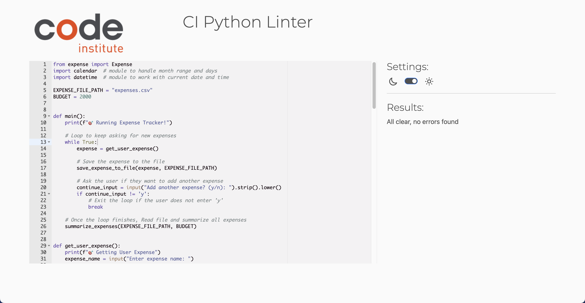
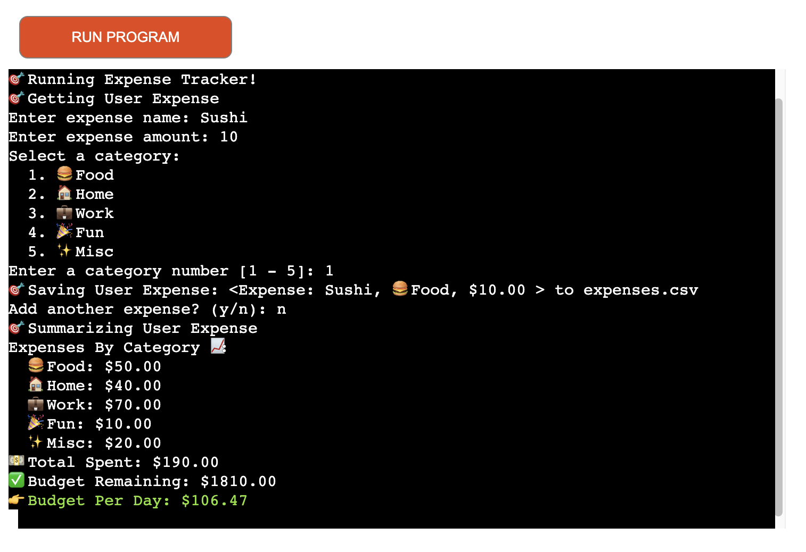
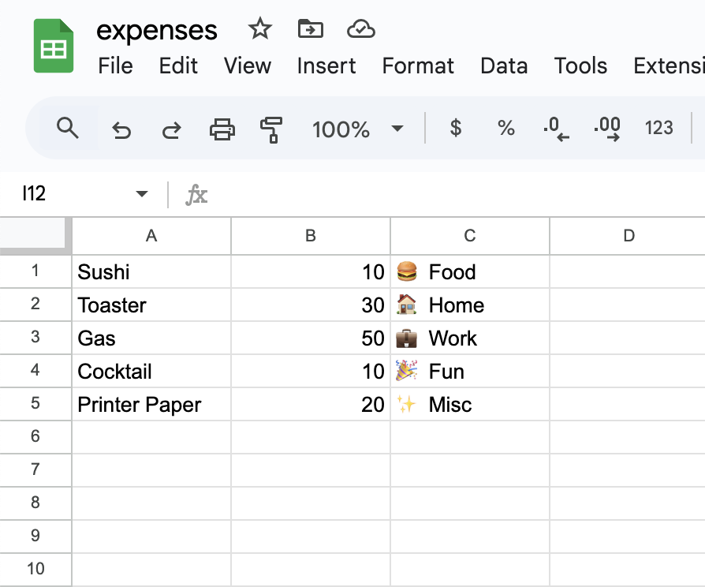

# **Expense Tracker**

[Click here to go to the Live Project](https://razmik-expense-tracker-066ff1e93a9e.herokuapp.com/)


Welcome to my Expense Tracker project!

The website allows users to track their expenses by adding and categorizing them. 
It displays the current balance and gives real-time feedback on spending trends. 
Users can add, delete, or edit expenses and view a list of past transactions.

I chose to build an expense tracker because managing personal finances is crucial, and this tool helps users stay on top of their spending habits. It provides a practical, user-friendly interface with a clear overview of their financial situation, while also offering useful insights to improve budgeting.

## **Table of contents**
- [**Expense Tracker**](#expense-tracker)
  - [**Table of contents**](#table-of-contents)
  - [**Planning**](#planning)
    - [**Features**](#features)
    - [**Used Technologies**](#used-technologies)
    - [**App Owner Goals**](#app-owner-goals)
    - [**User Stories**](#user-stories)
  - [**Testing**](#testing)
    - [**Manual Testing**](#manual-testing)
    - [**Bugs**](#bugs)
  - [**Deployment**](#deployment)
  - [**Version Control**](#version-control)
  - [**Development Process and Commands**](#development-process-and-commands)
  - [**Clone and Fork the Repository**](#clone-and-fork-the-repository)
    - [**Clone the Repository**](#clone-the-repository)
    - [**Fork the Repository**](#fork-the-repository)
  - [**Future Enhancements**](#future-enhancements)
  - [**Credits**](#credits)
  - [**Finished Product**](#finished-product)

## **Planning**

### **Features**

**Expense Tracker:** The goal of this project is to develop a Python app that allows users to track and categorize monthly expenses, helping them manage their budget. Users can input expense categories and amounts via the terminal, which are then saved to a file. The app will summarize the monthly expenses and calculate the remaining budget, based on a custom value.

### **Used Technologies**

- **Python**: Core programming language for the project.
- **Heroku**: Deployment platform for hosting the project.
- **GitPod**: Development environment for writing and testing the code.
- **GitHub**: Version control and repository hosting.
- **Buildpacks**: Python and Node.js buildpacks for Heroku deployment.
- **Markdown**: For documentation, such as your README file.


### **App Owner Goals**

- **Track Monthly Expenses**: Allow users to input and categorize expenses.
- **Store Data**: Save expenses in an `expenses.csv` file for future reference.
- **Provide Budget Summary**: Display total expenses and calculate remaining budget.
- **Allow Multiple Expenses**: Enable multiple entries with data persistence.
- **Handle Invalid Inputs**: Ensure invalid inputs are caught and users are prompted to correct them.
- **User-Friendly Interface**: Provide an easy-to-use terminal-based interface.

### User Stories

- As a user, I want to input the name of an expense to track my spending.
- As a user, I want to select an expense category (e.g., Home, Work) for organization.
- As a user, I want to input the amount of each expense to track my spending.
- As a user, I want my expenses saved in an `expenses.csv` file for future tracking.
- As a user, I want to see a summary of my monthly expenses to stay within my budget.
- As a user, I want to know how much money I have left to spend for the month.
- As a user, I want to continue adding or stop entering expenses at my convenience.
- As a user, I want invalid inputs to be handled and corrected smoothly.

## Testing

### Manual Testing

The following table outlines the manual testing performed on the project, with "X" indicating passed tests.

| **Test Case**                            | **Action**                                                                 | **Expected Result**                                              | **Result** |
|------------------------------------------|-----------------------------------------------------------------------------|------------------------------------------------------------------|-----------|
| **1. Input Name of Expense**             | Enter a name for an expense (e.g., "Sushi").                           | Expense name is successfully recorded.                          | X         |
| **2. Input Expense Amount**              | Enter a valid expense amount in the terminal.                              | Amount is successfully saved to the file.                       | X         |
| **3. Select Expense Category**           | Select a category for the expense (e.g., "Food").                          | Expense is categorized correctly.                               | X         |
| **4. Invalid Input Handling**            | Enter invalid data (e.g., letters for amount).                             | Error message displayed, prompting for valid input.             | X         |
| **5. Store Data in `expenses.csv` File** | Save all entered expenses into the `expenses.csv` file for future use.     | Data is correctly appended to the CSV file.                     | X         |
| **6. Continue Adding Expenses**          | Choose to add another expense after entering the first one.                | Application allows entry of additional expenses.                | X         |
| **7. Stop Adding Expenses**              | Choose to stop adding expenses after entering one or more.                 | Application stops and provides a summary of expenses.           | X         |
| **8. Summarize Expenses**                | View a summary of monthly expenses.                                        | Accurate totals for each category displayed.                    | X         |
| **9. Calculate Remaining Budget**        | Check remaining budget after adding expenses.                              | Correct remaining budget is displayed based on custom limit.    | X         |

## Bugs

There are no unfixed bugs or problems.




## **Deployment**

### Project Deployment on Heroku

The project was developed to be used with the [Code Institute Template](https://github.com/Code-Institute-Org/p3-template) on a mock terminal. It was deployed on Heroku following these steps:

1. **Create a Heroku account and log in.**
2. Click **New** and select **Create new app** on the dashboard.
3. Enter a unique name, select the region, and click **Create app**.
4. Within the created app, select the **Settings** tab.
5. In the **Config Vars** section, click **Reveal Config Vars**.
   - Add another config var with the key `PORT` and the value `8000`.
6. Below the **Config Vars** section, click **Add buildpack**:
   - Select **Python** and save.
   - Add another buildpack and select **Node.js**. 
   Ensure the buildpacks are listed in this order.
7. Navigate to the **Deploy** tab.
8. Select **GitHub** as the deployment method and connect to GitHub.
9. Search for the repository name of the project and click **Connect**.
10. Optionally, enable automatic deploys to deploy each time new code is pushed to the repository.
11. Click **Deploy Branch** to deploy the project immediately.


The live site on Heroku is available here: [Expense Tracker](https://razmik-expense-tracker-066ff1e93a9e.herokuapp.com/)

## Version Control
* The code is stored in the GitHub repository.
* The repository contains a single branch, and the code has been committed regularly to ensure clarity. The repository can be found at this [Link](https://github.com/RazmikMovsisyan/expense-tracker), and it can be cloned or downloaded for further development.

## Development Process and Commands

- I started the project by using the [gitpod P3 template](https://github.com/Code-Institute-Org/p3-template).
- I regularly staged changes using the command `git add <filename>` or `git add .`, then committed using `git commit -m 'short descriptive message here'`.
- Finally, I pushed the changes to GitHub with `git push`.
- Every push automatically deploys the latest changes to GitHub Pages from the 'main' branch.

## Clone and Fork the Repository

You can easily clone or fork the **Expense Tracker** repository for further development.

#### **Fork the Repository**

1. Visit the repository on GitHub: [Expense Tracker Repository](https://github.com/RazmikMovsisyan/expense-tracker).
2. Click the **Fork** button to create your own copy.

#### **Clone the Repository**

The repository has a single branch with a clear commit history. To clone the repository:

##### For **Mac** Users:

1. Open the **Terminal**.
2. Navigate to your preferred directory:  
   ```bash
   cd /path/to/your/directory
   ```
3. Clone the repository:  
   ```bash
   git clone https://github.com/RazmikMovsisyan/expense-tracker.git
   ```
4. Navigate into the directory:  
   ```bash
   cd expense-tracker
   ```

##### For **Windows** Users:

1. Open **Command Prompt** or **PowerShell**.
2. Navigate to the desired directory:  
   ```cmd
   cd C:\path\to\your\directory
   ```
3. Clone the repository:  
   ```cmd
   git clone https://github.com/RazmikMovsisyan/expense-tracker.git
   ```
4. Navigate into the directory:  
   ```cmd
   cd expense-tracker
   ```

## Future Enhancements

To improve the Expense Tracker, I plan to add the following features:

- **Recurring Expenses:** Option to add expenses that repeat monthly or annually.
- **Expense Charts:** Visual graphs to show how expenses are distributed across categories.
- **Password Protection:** Add user authentication to secure personal expense data.

## Credits

- Anna Greaves from Code Institute for great LMS Tutorials
- Thanks to the assessor of my previous projects for suggesting the use of [commits best practices](https://gist.github.com/luismts/495d982e8c5b1a0ced4a57cf3d93cf60) in [imperative mood](https://cbea.ms/git-commit/) to align with conventional standards and improve clarity and consistency in the project's commit history. This has improved the style of my commit messages, making them clear, concise, and easy to understand.
Also for the tip of the Testing section that could be improved by including a table listing all tests carried out on each page, alongside a check or an x indicating whether they passed or not.

## Finished Product

Here is an example screenshot of the finished product, showing the process of adding another expense to my existing expense list.



The finished expenses.csv file with its stored data and structure.

